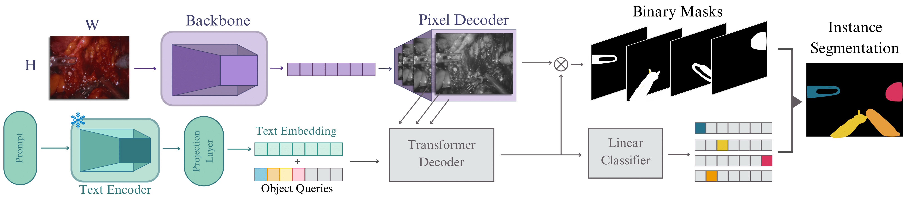

# LEMIS: Large Endoscopic Model for Instance Segmentation

<div align="center">
  
</div><br/>

LEMIS builds upon Mask2Former for instrument segmentation, enhancing semantic understanding through text embeddings. We leverage CLIP’s text encoder to generate embeddings from a prompt containing instrument names based on the frame’s dataset. Simultaneously, Mask2Former extracts visual features from the input frame via its backbone and processes them through a pixel decoder. The text embeddings are then fused with the object queries to enrich their representation, which are fed into the Transformer decoder. Finally, the model predicts class-mask pairs following the standard Mask2Former pipeline.

## Installation
Please follow these steps to run LEMIS:

```sh
$ conda create --name lemis python=3.12.9 -y
$ conda activate lemis
$ conda install pytorch==2.4.1 torchvision==0.19.1 pytorch-cuda=12.4 -c pytorch -c nvidia

$ https://github.com/ENDOVIS-MICCAI2025/LEMIS.git
$ cd LEMIS
$ pip install -r requirements.txt

$ pip install 'git+https://github.com/facebookresearch/fvcore'
$ pip install 'git+https://github.com/facebookresearch/fairscale'
$ python -m pip install 'git+https://github.com/facebookresearch/detectron2.git'
```

## Data Preparation

Coming ...

## Running the code

We provide bash scripts with the default parameters to evaluate each LED task. Please first download our preprocessed data files and pretrained models as instructed earlier and run the following commands to run evaluation on each task:

```sh
# Run the script corresponding to the desired task to evaluate
$ sh run_files/<endovis_2017/endovis_2018/grasp/sar_rarp50/led>_instruments
```

### Training LEMIS

You can easily modify the bash scripts to train our models. Just set ```TRAIN.ENABLE True``` on the desired script to enable training, and set ```TEST.ENABLE False``` to avoid testing before training. You might also want to modify ```TRAIN.CHECKPOINT_FILE_PATH``` to the model weights you want to use as initialization. You can modify the [config files](https://github.com/ENDOVIS-MICCAI2025/LEMIS/tree/main/configs) or the [bash scripts](https://github.com/ENDOVIS-MICCAI2025/LEMIS/tree/main/run_files) to alter the architecture design, training schedule, video input design, etc. We provide documentation for each hyperparameter in the [defaults script](https://github.com/ENDOVIS-MICCAI2025/LEMIS/blob/main/tapis/config/defaults.py).

### Evaluation metrics

Although our codes are configured to evaluate the model's performance after each epoch, you can easily evaluate your model's predictions using our evaluation codes and implementations. For this purpose, you can run the [evaluate script](https://github.com/ENDOVIS-MICCAI2025/LEMIS/blob/main/tapis/evaluate.py) and provide the required paths in the arguments as documented in the script. You can run this script on the output files of the [detectron2](https://github.com/facebookresearch/detectron2) library using the ```--filter``` argument, or you can provide your predictions in the following format:

```tree
[
      {"<frame/name>":
            
            {
             # For long-term tasks
             "<phase/step>_score_dist": [class_1_score, ..., class_N_score],

             # For short-term tasks
             "instances": 
             [
                 {
                  "bbox": [x_min, y_min, x_max, y_max],
                  "<instruments/actions>_score_dist": [class_1_score, ..., class_N_score],
                  
                  # For instrument segmentation
                  "segment" <Segmentation in RLE format>
                 } 
             ]
            }
      },
      ...
]
```

You can run the ```evaluate.py``` script as follows:

```sh
$ python evaluate.py --coco_anns_path /path/to/coco/annotations/json \
--pred-path /path/to/predictions/json or pth \
--output_path /path/to/output/directory \
--tasks <instruments/actions/phases/steps> \
--metrics <mAP@0.5IoU_box/mAP@0.5IoU_segm/mIoU> \
(optional) --masks-path /path/to/segmentation/masks \
# Optional for detectron2 outputs
--filter \
--slection <topk/thresh/cls_thresh/...> \
--selection_info <filtering info> 
```

## Instrument Segmentation Baseline

Our instrument segmentation baseline is based on [Mask2Former](https://github.com/facebookresearch/Mask2Former), so we recommend checking their repo for details on their implementation. 

### Installation

To run our baseline, first go to the region proposal directory and install the corresponding dependencies. You must have already installed all the required dependencies of the main LEMIS code. The following is an example of how to install dependencies correctly.

```sh
# Needed in some machines
# conda install conda-forge::cudatoolkit-dev -y
# conda install nvidia/label/cuda-11.7.0::cuda

$ conda activate lemis
$ cd ./region_proposals
$ pip install -r requirements.txt
$ cd mask2former/modeling/pixel_decoder/ops
$ sh make.sh
$ cd ../../../..
```
### Running the Segmentation Baseline

The original Mask2Former code does not accept segmentation annotations in RLE format; hence, to run our baseline, you must first transform our RLE masks into Polygons using the [rle_to_polygon.py](https://github.com/ENDOVIS-MICCAI2025/LEMIS/blob/main/region_proposals/rle_to_polygon.py) script as follows:

```sh
$ python rle_to_polygon.py --data_path /path/to/LED/annotations
```

Then to run the training code run the [train_net.py](https://github.com/ENDOVIS-MICCAI2025/LEMIS/blob/main/region_proposals/train_net.py) script indicating the path to a configuration file in the [configs directory](https://github.com/ENDOVIS-MICCAI2025/LEMIS/blob/main/region_proposals/configs) with the ```--config-file``` argument. You should also indicate the path to the GraSP dataset with the ```DATASETS.DATA_PATH``` option, the path to the pretrained weights with the ```MODEL.WEIGHTS``` option, and the desired output path with the ```OUTPUT_DIR``` option. Download the pretrained Mask2Former weights for instance segmentation in the COCO dataset from the [Mask2Former](https://github.com/facebookresearch/Mask2Former) repo. Use the following command to train our baseline:

```sh
$ python train_net.py --num-gpus <number of GPUs> \
--config-file configs/led/<config file name>.yaml \
DATASETS.DATA_PATH path/to/LED/dataset \
MODEL.WEIGHTS path/to/pretrained/model/weights \
OUTPUT_DIR output/path
```

You can modify most hyperparameters by changing the values in the configuration files or using command options; please check the [Detectron2](https://github.com/facebookresearch/detectron2) library and the original [Mask2Former](https://github.com/facebookresearch/Mask2Former) repo for further details on configuration files and options.<br/>

To run the evaluation code, use the ```--eval-only``` argument and the LEMIS model weights provided in the [data link](). Run the following command to evaluate our baseline:

```sh
$ python train_net.py --num-gpus <number of GPUs> --eval-only \
--config-file configs/grasp/<config file name>.yaml \
DATASETS.DATA_PATH path/to/grasp/dataset \
MODEL.WEIGHTS path/to/pretrained/model/weights \
OUTPUT_DIR output/path
```

**Note:** You can easily **run our segmentation baseline in a custom dataset** by modifying the ```register_surgical_dataset``` function in the [train_net.py](https://github.com/ENDOVIS-MICCAI2025/LEMIS/blob/main/region_proposals/train_net.py) script to register the dataset in a COCO JSON format. Once again, we recommend checking the [Detectron2](https://github.com/facebookresearch/detectron2) library and the original [Mask2Former](https://github.com/facebookresearch/Mask2Former) for more details on registering your dataset.

### Region Features

Our code allows calculating region features during training and validation (on the fly) or storing precalculated region features:

Our published results are based on stored region features, as calculating features on the fly significantly increases computational complexity and slows training down. Our code stores the region features corresponding to the predicted segments in the same results files in the output directory of the segmentation baseline. However, you can use the [match_annots_n_preds.py](https://github.com/ENDOVIS-MICCAI2025/LEMIS/blob/main/data/match_annots_n_preds.py) script to filter predictions, assign region features to ground truth instances for training, and parse predictions into necessary files for LEMIS. Use the code as follows:

```sh
$ python match_annots_n_preds.py 
```

To calculate region features on the fly, we provide an example of configuring our code in the ```run_files/grasp_short-term_rpn.sh``` file.